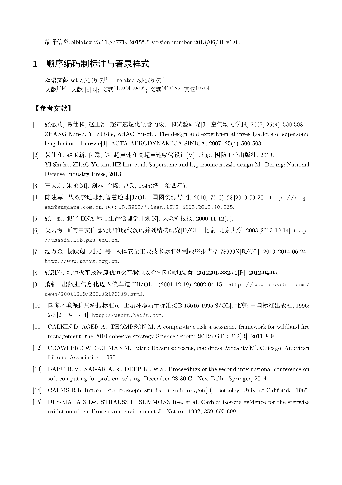
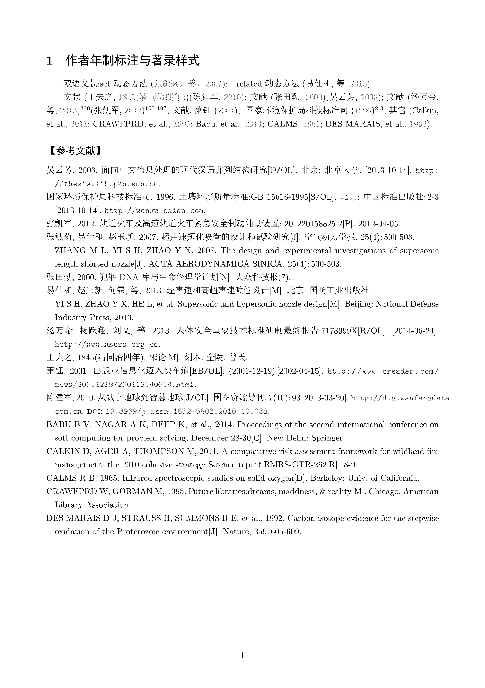
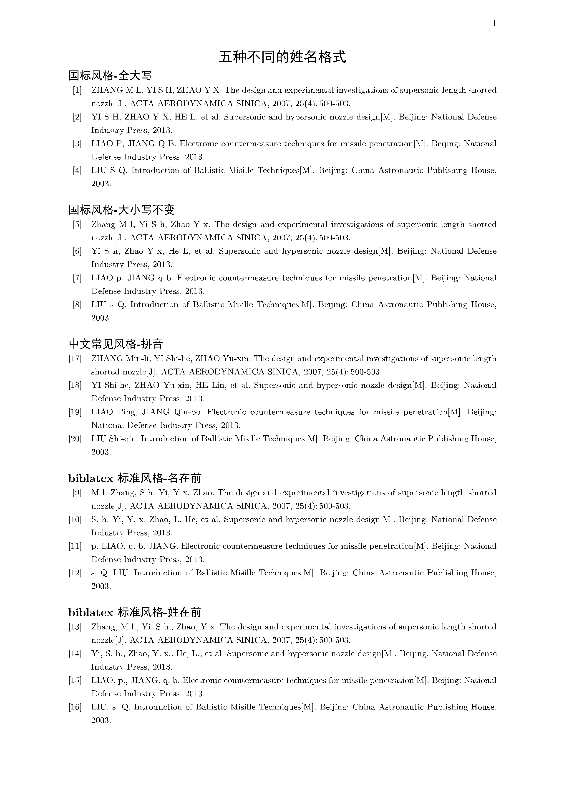

<b>Date of last change: 2018-06-01 to version v1.0i</b>


# biblatex-gb7714-2015: a biblatex style  package
---------------------------------------------------------
[使用入门](#jumptotutorial)  |==| [说明文档](biblatex-gb7714-2015.pdf) |==| [WIKI](https://github.com/hushidong/biblatex-gb7714-2015/wiki) 
    

## Introduction

Maintainer: huzhenzhen <hzzmail@163.com>

Homepage: <https://github.com/hushidong/biblatex-gb7714-2015>

License: LaTeX Project Public License 1.3 or later


A biblatex implementation of the `GB/T 7714-2015` bibliography style for Chinese users

The biblatex-gb7714-2015 package provides an implementation of the bibliography style of the `GB/T 7714-2015` bibliography style. This implementation follows `GB/T 7714-2015` standard, and can be used simply by loading biblatex with the appropriate option

## Usage
* for numerical sequence style

    `\usepackage[backend=biber,style=gb7714-2015]{biblatex}`

    - add an option `gbalign` to control the align style of the numerical label：
	
		`gbalign=right`  for the label ragged left in a list environment
		
		`gbalign=center` for the same width label in a list environment with the number centered in the bracket
		
		`gbalign=left`   for the label ragged right in list environment
		
		`gbalign=gb7714-2015` for the label in paragraph with same separator space between label and entry content

        `\usepackage[backend=biber,style=gb7714-2015,gbalign=gb7714-2015]{biblatex}`

    - add an option `gbpub` for dealing publishing items, option value = `true` for gb7714 style or `false` for standard style. This option is also for author year style.

        `\usepackage[backend=biber,style=gb7714-2015,gbpub=true]{biblatex}`
        
    - add an option `gbnamefmt` for dealing name's letter case(this option is also for author year style):

        `gbnamefmt = uppercase` for gb7714 style 
		
        `gbnamefmt = lowercase` for gb7714 style with no case switch of names 
		
        `gbnamefmt = givenahead` for standard style, given-family style, like ieee style
		
		`gbnamefmt = familyahead` for standard style, family-given style, like apa style. 
		
        `gbnamefmt = pinyin` for a common Chinese style, like: ZHANG Min-li, YI Shi-he and so on. 
		
		the name format can be set per-entry using a field：`nameformat`=`pinyin` or others. This option is also for author year style.

        `\usepackage[backend=biber,style=gb7714-2015,gbnamefmt=uppercase]{biblatex}`
		
	- add an option `gbbiblabel` to control the format of the numerical label：
	
		`gbbiblabel=bracket`  for the numerical number in the label wrapped by bracket
		
		`gbbiblabel=parens`   for the numerical number in the label wrapped by parenthesis
		
		`gbbiblabel=plain`    for the numerical number in the label wrapped by nothing
		
		`gbbiblabel=dot`      for the numerical number in the label followed with dot
		
		`gbbiblabel=box`      for the numerical number in the label wrapped by box which generated by `\framebox`
		
		`gbbiblabel=circle`   for the numerical number in the label wrapped by circle which generated by `\textcircled`

        `\usepackage[backend=biber,style=gb7714-2015,gbbiblabel=bracket]{biblatex}`
		
	- add an option `gbtype` for dealing the reference type and carrier identifier like a [J/OL] for an on-line article, option value = `true` for gb7714 style or `false` for none identifier, e.g. An article title followed by empty string instead of the [J/OL]. This option is also for author year style.

        `\usepackage[backend=biber,style=gb7714-2015,gbtype=true]{biblatex}`
		
	- add an option `gbpunctin` to control the output of `//` before bookauthor for entrytypes like inbook/incollection/inproceedings. `gbpunctin=true` to output `//`, `gbpunctin=false` to output the bibstring for English is IN:, If want to eliminate it at all, please add a cmd `\DefineBibliographyStrings{english}{in={}}` in the preamble. This option is also for author year style.

        `\usepackage[backend=biber,style=gb7714-2015,gbpunctin=true]{biblatex}`
		
	- add an option `gbctexset` to set the bibliography title's control method. default is `gbctexset=true` with the title can be set by `\bibname` or `\refname` and the printbibliography option `title=title you want`,if `gbpunctin=false`, the title can be set by bibstring like `\DefineBibliographyStrings{english}{bibliography={title you want}}` or `\DefineBibliographyStrings{english}{references={title you want}}` and the printbibliography option `title=title you want`.This option is also for author year style.

        `\usepackage[backend=biber,style=gb7714-2015,gbctexset=true]{biblatex}`
		
	- add an option `gbcodegbk` to deal tex file encoded with GBK. if want to compile GBK file with pdflatex or latex，set `gbcodegbk=true` is needed. if compile with xelatex, it should be none or `gbcodegbk=false`. This option is also for author year style.

        `\usepackage[backend=biber,style=gb7714-2015,gbcodegbk=false]{biblatex}`
		
	- add an option `gbstrict` to control the output of some unnecessary fields for GB/T7714-2015. If want to output them as the standard styles, it should be `gbstrict=false`. default is `gbstrict=true`. This option is also for author year style.

        `\usepackage[backend=biber,style=gb7714-2015,gbstrict=true]{biblatex}`
		
	- add an option `gbfieldstd` to control the format of some fields such as title, url and pages. option value = `false` for gb7714 style or `true` for standard style. This option is also for author year style.
	
        `\usepackage[backend=biber,style=gb7714-2015,gbfieldstd=false]{biblatex}`
		
	- add an option `gbtitlelink` to control the hyperlink of title field. option value = `false` with none link or `true` to set the hyperlink. This option is also for author year style.
	
        `\usepackage[backend=biber,style=gb7714-2015,gbtitlelink=true]{biblatex}`

* for author year style

    `\usepackage[backend=biber,style=gb7714-2015ay,gbpub=true]{biblatex}`

    - add an option `gbnoauthor` for dealing undefined author, option value = `true` for gb7714 style or `false` for standard style. 

        `\usepackage[backend=biber,style=gb7714-2015ay,gbnoauthor=true]{biblatex}`
	
* for perl script transformation tool(only for the numerical style)

    `perl gb7714texttobib.pl in=textfilename out=bibfilename`

A demonstration database is provided to show how to format input for the style. The biblatex-gb7714-2015 style works with texlive2014, texlive2015, texlive2016, texlive2017 , texlive2018 and so on.

please see the file 'biblatex-gb7714-2015.pdf' for further information!


## Applications

* [SJTUThesis(上海交通大学学位论文模板)](https://github.com/sjtug/SJTUThesis)(母校的论文模板，不得不说缘分真的很神奇)
* [fduthesis(复旦大学论文模板)](https://github.com/Stone-Zeng/fduthesis)
* [ECNU-Undergraduate-LaTeX(华东师范大学本科毕业论文模板)](https://github.com/YijunYuan/ECNU-Undergraduate-LaTeX)
* [UCASthesis(中国科学院大学学位论文模板**国科大新版标准**)](https://github.com/xiaoyao9933/UCASthesis)
* [Study-LaTeX(LaTeX学习笔记)](https://github.com/Zousiyu/Study-LaTeX)
* [LaTeX-template(开箱即用的 LaTeX 模板)](https://github.com/tsai1993/LaTeX-template)
* [Zhejiang University thesis(浙江大学毕业设计/论文模板)](https://github.com/TheNetAdmin/zjuthesis)
* [fjnu-bathesis (福建师范大学本科毕业论文LaTeX 模板)](https://github.com/fjnuer/fjnu-bathesis)
* [...]


## Related Links

* [Biblatex 宏包](https://github.com/plk/biblatex)
* [Beamer 文档类](https://github.com/josephwright/beamer)
* [biblatex 宏包中文手册 ](https://github.com/hushidong/biblatex-zh-cn)
* [biblatex 简明使用手册](https://github.com/hushidong/biblatex-solution-to-latex-bibliography)
* [biblatex-caspervector: caspervector 设计的中文参考文献样式](https://github.com/CasperVector/biblatex-caspervector)
* [gbt7714-bibtex-style: GB/T7714-2015 标准的bst实现版本](https://github.com/zepinglee/gbt7714-bibtex-style)
* [LaTeX学习网站](http://www.latexstudio.net/)
* [LaTeX交流论坛](http://bbs.ctex.org/)

---------------------------------------------------------

<h2 id="jumptotutorial">Tutorial/使用入门</h2>

[comment]: # (这里这种方式不适合可能主要是因为标题所导致，因此用上面的方式进行处理
<span id="jumptotutorial">## Tutorial/使用入门</span>)


<h3 id="jumptotexsrcf">1. Tex source file/tex文档一般结构</h3>

```
\documentclass{article}%文档类%导言区开始:

\usepackage{ctex}%加载ctex宏包，中文支持

\usepackage[left=20mm,right=20mm,top=25mm, bottom=15mm]{geometry}%加载geometry宏包，定义版面

\usepackage[colorlinks=true,pdfstartview=FitH,%
linkcolor=blue,anchorcolor=violet,citecolor=magenta]{hyperref}%加载hyperref宏包，使用超链接

\usepackage[backend=biber,bibstyle=gb7714-2015,%nature,%%加载biblatex宏包，使用参考文献
citestyle=gb7714-2015%,backref=true%%其中后端backend使用biber
]{biblatex}%标注(引用)样式citestyle，著录样式bibstyle都采用gb7714-2015样式

\addbibresource[location=local]{example.bib}%biblatex宏包的参考文献数据源加载方式


\begin{document}%正文区开始:

%正文内容，引用参考文献

1. 不带页码的引用(顺序编码制上标，方括号包围；作者年制行内，括号包围):
\cite{Peebles2001-100-100}\upcite{Peebles2001-100-100}\supercite{Peebles2001-100-100}

2. 不带页码的引用(顺序编码制非上标，方括号包围；作者年制行内，括号包围):
\parencite{Miroslav2004--}

3. 带页码的引用(标准命令，默认样式; 增加命令，GB/T 7714-2015样式):
\cite[见][49页]{蔡敏2006--}  \parencite[见][49页]{Miroslav2004--}
\pagescite{Peebles2001-100-100}  \pagescite[][201-301]{Peebles2001-100-100}

4. 顺序编码制中同时输出作者和顺序编码标签，比如：
（一）直接的方法：见\citeauthor{refb}\cite{refb},\citeauthor{refc}\cite{refc}
（二）定义新的标注命令：见\authornumcite{refb,refc}
（三）用textcite但没有上标：见\textcite{refb,refc}

5. 作者年制文中已有作者还需要年份和页码(顺序编码制与pagescite作用相同，作者年制年份行内页码上标):
见赵耀东\yearpagescite[][205]{赵耀东1998--}和Simon\yearpagescite[][15]{Simon2001--}

6. 作者年制文中已有作者只需要年份(顺序编码制与pagescite作用相同，作者年制年份行内):
见赵耀东\yearcite{赵耀东1998--}
见赵耀东(\cite*{赵耀东1998--})
见赵耀东(\citeyear{赵耀东1998--})

7. 作者年制中由标注命令给出作者年份信息，作者以主语方式作为正文内容：
\textcite{赵耀东1998--}

8. 在页脚中引用和打印文献表:
\footnote{在脚注中引用\footcite{赵学功2001--}}  \footfullcite{赵学功2001--}


%打印参考文献表
\printbibliography[heading=bibliography,title=参考文献]
\end{document}
```

### 2. Compile method/文档编译方式

```
xelatex jobname.tex
biber jobname
xelatex jobname.tex
xelatex jobname.tex
```

### 3. Recommended environment/推荐使用环境
    
- Texlive+Winedt
- Texlive+Texstudio
	
### 4. Common questions/常见问题

#### 4.1 Installation and use/安装和使用

* <b>怎么利用biblatex生成国标GB/T 7714-2015格式的参考文献表？</b>

> (1)在导言区加载biblatex宏包，并使用gb7714-2015样式:

```\usepackage[backend=biber,style=gb7714-2015]{biblatex}```

> (2)正文中引用参考文献:

```见文献\cite{referencbibtexkey}```

> (3)在需要的地方打印参考文献表:

```\printbibliography```
	   
更直接的例子见前述的[tex源文档](#jumptotexsrcf)
		
		
		
* <b>请问我应该怎么安装和更新biblatex-gb7714-2015宏包？</b>
		
> biblatex-gb7714-2015宏包是基于biblatex的样式宏包，目前texlive，miktex都已收录，因此可以直接使用，一般不需要安装。如果使用时，系统提示找不gb7714-2015.bbx或gb7714-2015ay.bbx文件的错误，说明当前tex系统未安装biblatex-gb7714-2015样式包，这时需要安装它。最简单的方法是从本项目源码中下载 gb7714-2015.bbx, gb7714-2015ay.bbx, gb7714-2015.cbx, gb7714-2015ay.cbx 四个文件放到你要编译的主文档所在目录，如果需要使用gbk编码，则还需复制 gb7714-2015-gbk.def 文件。对于已经安装的用户需要更新到最新版，则可以下载这些文件替换系统已经安装的文件。


* <b>为什么我之前使用样式`style=caspervector`进行编译没有问题，换成`style=gb7714-2015`后，编译就出现错误？</b>
	
> 可能有三个原因：

> 1. 辅助文件没有清理导致，当采用caspervector样式时编译产生的辅助文件中可能带有该样式的一些特有信息，由此产生一些不兼容。因此需要的操作是，清除辅助文件，然后再进行编译。清除命令为(下面的命令是windows下的，linux下的是类似的只需把删除命令换成`rm -f`)：

```del /q *.aux *.bbl *.blg *.log *.out *.toc *.bcf *.xml *.synctex *.nlo *.nls *.bak *.ind *.idx *.ilg *.lof *.lot *.ent-x *.tmp *.ltx *.los *.lol *.loc *.listing *.gz *.synctex(busy) *.nav *.snm *.vrb *.fls *.xdv *.fdb_latexmk```

> 2. biblatex-gb7714-2015 版本过于陈旧，旧版本对于一些特殊情况可能考虑不全面。因此需要的操作是更新biblatex-gb7714-2015，方法见上一个问题。

> 3. 编译命令问题，通常情况下tex文档和bib文档是utf8编码的，因此最好采用xelatex编译，而不用pdflatex。因此如果编译时用pdflatex出现错误，请换成xelatex。


* <b>为什么利用 ctex2.9 套装进行编译时，出现错误？</b>
	
> 由于ctex2.9套装多年未更新，其中的biblatex宏包过于陈旧，所以需要更新 biblatex。
	
	
	
* <b>我希望参考文献表中的文献不是按引用顺序而是以文献作者的字母顺序排序，怎么实现？</b>
		
> 一般情况下文献表是按引用顺序进行排列，标签是顺序的数字，这种方式称为顺序编码制。
> 如果要以文献作者字母顺序排列，那么可以换一种编制方式，称为作者年制:
		
```\usepackage[backend=biber,style=gb7714-2015ay]{biblatex}```

> 如果要求使用顺序编码制文献表，又要以文献作者字母顺序排列，那么可以增加排序选项`sorting=nyt`:
		
```\usepackage[backend=biber,style=gb7714-2015,sorting=nyt]{biblatex}```
	
	
	
* <b>作者年制中英文文献能按字母顺序排列，那么中文文献能否以拼音或者笔画进行排序呢？</b>
	
> 能，可以通过编译时给biber设置选项来实现:
		
```
%按拼音排序，biber命令
biber -l zh__pinyin jobname
%按笔画排序，biber命令
biber -l zh__stroke jobname
```

> 或者，也可以通过增加 biblatex 选项来实现（此时biber编译无需另加选项），比如：

```\usepackage[backend=biber,style=gb7714-2015ay,sortlocale=zh__pinyin]{biblatex}```

		
		
* <b>作者年制参考文献表目前的排序时升序排列，能不能改成降序排序？</b>
		
> 能，这需要通过修改gb7714-2015ay.bbx中的代码来实现，找到:

```\sort{%[direction=descending]```

> 修改为:

```\sort[direction=descending]{%```


* <b>我希望文献表以阿拉伯数字编号，而正文中的引用标签使用作者和年份标注而不是数字，请问我该如何处理？</b>

> 可以设置不同的标注和著录样式，比如标注样式用作者年制，而著录样式用顺序编码制，比如:

```\usepackage[backend=biber,citestyle=gb7714-2015ay,bibstyle=gb7714-2015]{biblatex}```

> 参见:[issue:参考文献的顺序](https://github.com/sjtug/SJTUThesis/issues/300)


* <b>如果我还希望顺序编码的文献著录表以拼音排序，请问该怎么操作？</b>

> 顺序编码文献著录表默认是按引用顺序排序，但可以通过设置sorting选项进行调整，比如sorting=nyt表示按作者姓名年份以及文献标题进行排序。要使中文能按拼音排序，可以设置本地化排序调整方案，即sortlocale选项，比如:

```\usepackage[backend=biber,citestyle=gb7714-2015ay,bibstyle=gb7714-2015,sorting=nyt,sortlocale=zh__pinyin]{biblatex}```

		
		
* <b>请问如果参考文献中存在一些特殊字符比如&或者一些特殊命令比如\LaTex{}等，是不是会出现问题？</b>
	
> 通常不会出现问题，直接输入即可，当出现问题时可以手动调整比如修改为`\&`和`{\LaTex{}}`


* <b>如果希望在参考文献中直接使用一些unicode字符比如希腊字母等而不想用数学环境中的命令，请问该怎么处理？</b>
	
> 直接显示希腊字母等unicode字符需要字体的支持，比如CMU Serif等，可以在整个文档全局使用该字体，也可以仅在文献表中使用该字体，比如：

```
{
\newcommand{\ftcmu}{\fontspec{CMU Serif}\selectfont}
\renewcommand{\bibfont}{\ftcmu}%设置英文字体不影响中文字体
\printbibliography
}
```

> 当然字体设置需要fontspec宏包的支持。
		
		
		
* <b>我习惯用传统的bst文件来生成参考文献，有没有GB/T 7714-2015标准的实现版本？</b>
	
> GB/T 7714-2015标准实现的bst版本，已经由[zeping lee](https://github.com/zepinglee/gbt7714-bibtex-style)开发完毕，直接使用即可。
	
	
	
* <b>我在使用过程中遇到了一些无法理解和无法解决的问题，怎么办？</b>
	
> 请邮件联系hzzmail@163.com或在项目内发issue提问即可。
		
	
#### 4.2 Bibliography format/文献表著录格式

* <b>请问可以在参考文献表中实现类似于word那样的与文献内容等间距标签对齐格式么？</b>
	
> 可以，latex的列表通常用list来实现，因此一般列表的内容都是对齐的，
> 此时如果标签右对齐的，那么标签和内容等间距，但标签左侧是不对齐的。
> 如果标签是左对齐的，那么标签和内容的间距不相等。
> 如果要求标签左侧对齐，且标签与内容等间距必须放弃使用list。
> biblatex-7714-2015的顺序编码制样式特别设计了这样的环境，以保持和word一致。通过设置选项gbalign来实现:
		
```\usepackage[backend=biber,bibstyle=gb7714-2015,gbalign=gb7714-2015]{biblatex}```
		
		
		
* <b>如果不希望在参考文献表中出现类似“出版地不详”“出版者不详”等信息时，请问该怎么处理？</b>
	
> 设置选项gbpub可以实现，当gbpub=false时，biblatex-gb7714-2015宏包会放弃国标的要求，不使用“出版地不详”等补充信息:
		
```\usepackage[backend=biber,bibstyle=gb7714-2015,gbpub=false]{biblatex}```

		
		
* <b>我觉得文献表中英文作者全部用大写不好看，请问能换一种大小写方式么？</b>
	
> 能，通过设置gbnamefmt可以实现，默认情况下gbnamefmt=uppercase，作者姓名字母全部大写。
> 当设置gbnamefmt=lowercase时，biblatex-gb7714-2015宏包对于bib文件中的作者姓名的大小写不做改变，
> 这时可以在bib文件中手动设置想要的大小写方式。
> 当要实现类似ZHAO Yu-xin这样的拼音方式，则可以设置gbnamefmt=pinyin:
		
```\usepackage[backend=biber,bibstyle=gb7714-2015,gbnamefmt=lowercase]{biblatex}```
		
		
		
* <b>如果不希望在参考文献表中出现类似“[M]”“[J]”等文献类型标识符时，请问该怎么处理？</b>
	
> 可通过设置选项gbtype=false实现:
		
```\usepackage[backend=biber,bibstyle=gb7714-2015,gbtype=false]{biblatex}```
		
		
		
* <b>如果不希望在参考文献表中出现网址信息时，请问该怎么处理？</b>
	
> 可通过设置选项url=false实现:
		
```\usepackage[backend=biber,bibstyle=gb7714-2015,url=false]{biblatex}```
	
	
	
* <b>如果不希望在参考文献表中出现DOI信息时，请问该怎么处理？</b>
	
> 可通过设置选项doi=false实现:
		
```\usepackage[backend=biber,bibstyle=gb7714-2015,doi=false]{biblatex}```
		
		
		
* <b>当参考文献没有作者时，希望用佚名或Anon代替作者时，请问该怎么处理？</b>
	
> 可通过设置选项gbnoauthor=true实现，注意该处理主要用在作者年制中:
		
```\usepackage[backend=biber,bibstyle=gb7714-2015,gbnoauthor=true]{biblatex}```
		
		
		
* <b>如果希望参考文献表中文献作者数量超过国标规定的3个时，请问该怎么处理？</b>
	
> 可通过设置选项maxbibnames，minbibnames实现，比如下面的设置用于显示5个作者:
		
```\usepackage[backend=biber,bibstyle=gb7714-2015,maxbibnames=5,minbibnames=5]{biblatex}```
	
	
	
* <b>请问如何使文献表中文献标题的是句首字母大写而其它所有字母均小写？</b>
	
> 默认情况下，biblatex-gb7714-2015不对标题的字母大小写做处理，因此要得到想要的字母大小写格式，
> 需要在bib文件输入参考文献信息时给出需要的大小写格式。
		
		
		
* <b>请问如何使文献表中的期刊名是单词首字母大写的？</b>
	
> 默认情况下，biblatex-gb7714-2015不对期刊名的字母大小写做处理，
> 因此需要在bib文件输入参考文献信息时给出需要的大小写格式。
		
		
		
* <b>我想得到中英文对照的双语参考文献，请问该如何处理？</b>
	
> biblatex-gb7714-2015设计了两种多语言对照参考文献的实现方式，
> 一种是利用条目集的概念，另一种是利用关联条目的概念。
> 因此有两种方法:

> 方法一，动态定义条目集:
> 在导言区或正文中定义:
```\defbibentryset{易仕和，等，2013}{易仕和2013--,Yi2013--}```

> 在正文中引用:
``双语文献引用\cite{易仕和，等，2013}```

> 方法二，动态定义关联条目:
> 在导言区定义:
```\defdoublelangentry{易仕和2013--}{Yi2013--}```

> 在正文中引用:
```双语文献引用\cite{易仕和2013--}```
		
	
	
#### 4.3 Citation format/正文引用的标注格式

* <b>我希望在正文中同时使用上标和非上标的引用标签，请问该怎么操作？</b>
	
> 可以使用不同的命令来实现上标和非上标的标签，
> 上标标签的命令为`\cite{bibtexkey}`，非上标标签的命令为`\parencite{bibtexkey}`。
> 当希望上标的标签也给出国标要求的页码时，则可以使用`\pagescite[50-55]{bibtexkey}`给出指定页码
> 或者`\pagescite{bibtexkey}`直接使用bib文件中的页码。
	
	
	
* <b>我在引用文献时已经给出作者信息，希望引用标签仅包含年份和页码信息或者仅包含年份信息时，该怎么操作？</b>
	
> 需要给出年份的标签是作者年制的标签，可以使用命令`\yearpagescite{bibtexkey}`给出包含年份和页码信息的标签，
> 使用命令`\yearcite{bibtexkey}`给出仅包含年份的标签。


* <b>在使用作者年制时，我希望文献表是按作者年份标题排序，而正文某处一个cite命令引用多个参考文献，且这些文献的标签是按年份作者标题排序，该怎么操作？</b>
	
> 有两种方法:

> 一是自动排序

> 宏包加载时使用:

```\usepackage[backend=biber,style=gb7714-2015ay,sortcite,sorting=ynt]{biblatex}```

> 正文中引用:

```\cite{refa2010,refb2008,refc2009}```

> 然后在文献打印前加

```\newrefcontext[sorting=nyt]```

> 二是手动给出排序

> 宏包加载时使用

```\usepackage[backend=biber,style=gb7714-2015ay]{biblatex}```

> 引用多个文献时按照年份顺序给出引用关键字，即正文中引用:

```\cite{refb2008,refc2009,refa2010}```

> 参考:[issue:citation的顺序和bibliography的顺序如何不关联](https://github.com/hushidong/biblatex-gb7714-2015/issues/30)


		
* <b>请问希望正文中作者年制的标注(引用)标签中作者数量超过国标规定的1个时，该怎么处理？</b>
	
> 可通过设置选项maxcitenames，mincitenames实现，比如下面的设置用于显示5个作者:

```\usepackage[backend=biber,style=gb7714-2015ay,maxcitenames=5,mincitenames=5]{biblatex}```
		
		
		
* <b>请问希望正文中作者年制的标注(引用)标签中作者数量只能是1个，而不管是否存在歧义时，该怎么处理？</b>
	
> 可通过设置选项uniquelist=false实现，该设置标签中的作者只会是指定的1个:

```\usepackage[backend=biber,style=gb7714-2015ay,uniquelist=false]{biblatex}```
		
		
		
* <b>请问希望正文中作者年制的标注(引用)标签中作者数量只能是1个，且只用其作者的姓而不管是否存在歧义时，该怎么处理？</b>
	
> 可通过设置选项uniquelist=false, uniquename=false实现，该设置标签中的作者只会是指定的1个且只用该作者的姓:

```\usepackage[backend=biber,style=gb7714-2015ay,uniquelist=false,uniquename=false]{biblatex}```
	
	
	
### 5. Examples/著录和标注结果示例
* 顺序编码制


	
* 作者年制




* 姓名的格式更改

对于bib文件中的如下条目，有:

    @Article{Zhang2007-500-503,
      Title                    = {The design and experimental investigations of supersonic length shorted nozzle},
      Author                   = {Zhang, Min-li and Yi, Shi-he and Zhao, Yu-xin},
      Journal                  = {ACTA AERODYNAMICA SINICA},
      Number                   = {4},
      Pages                    = {500-503},
      Volume                   = {25},
      Year                     = {2007}
    }

    @Book{Yi2013--,
      Title                    = {Supersonic and hypersonic nozzle design},
      Address                  = {Beijing},
      Author                   = {Yi, Shi he and Zhao, Yu xin and He, Lin and Zhang, Min li},
      Publisher                = {National Defense Industry Press},
      Year                     = {2013}
    }

    @Book{LIAO2012--,
      Title                    = {Electronic countermeasure techniques for missile penetration},
      Address                  = {Beijing},
      Author                   = {LIAO, ping and JIANG, qin bo},
      Publisher                = {National Defense Industry Press},
      Year                     = {2013}
    }

    @Book{LIU2003--,
      Title                    = {Introduction of Ballistic Misille Techniques},
      Address                  = {Beijing},
      Author                   = {LIU, shi Qiu},
      Publisher                = {China Astronautic Publishing House},
      Year                     = {2003}
    }



---------------------------------------------------------

## Need to do:
    * special characters in all fields?
    * entry without author: the delimiter between title and year?
	* TEST FOR texlive 2015,2016
	* [1]，(1)，1.，box{1}，superscript，compress，noncompress

---------------------------------------------------------

## Version history:

* 2016/05/20 v1.0  
* 2016/10/23 v1.0a 
* 2016/11/11 v1.0b
* 2016/11/14 v1.0c 
* 2016/11/24 v1.0d 
* 2016/12/07 v1.0e
* 2017/02/26 v1.0g 
* 2017/04/11 v1.0h 
* 2017/11/21 v1.0i
* 2018/01/20 v1.0j 
* 2018/04/03 v1.0k
* 2018/06/01 v1.0l

---------------------------------------------------------
## Update history:

date of update: 2018-06-01 to version v1.0l


* 增加gbctexset选项设置参考文献标题内容的控制方式，即，除了相同的printbibliography选项方式外，选择是通过 bibname 或 refname 控制还是通过定义本地化字符串 bibliography 或 references 控制。 (20180702)

add an option `gbctexset` to set the bibliography title's control method, i.e. besides the same printbibliography option method, two methods: control by \bibname or \refname and control by DefineBibliographyStrings is selected by this option.


* 增加gbbiblabel选项来控制顺序编码制文献表序号标签的格式，即用方括号、圆括号、点、方框、圆圈等来装饰序号数字。(20180623)

add an option gbbiblabel to control the format of the numerical label, i.e. the label number is wrapped by bracket, parenthesis,dot,box,circle and so on.

* 增加\bibitemindent尺寸配合\bibhang设置基于list的文献表环境的缩进。(20180615)

add a length \bibitemindent to control the item indent of bibliography based on list env with \bibhang。

* 增加upcite命令为兼容一些老的文档，顺序编码制中同supercite，作者年制中同yearcite。(20180604)

add upcite to be compatible with some old doc，it behaves like supercite in numerical style and yearcite in author year style. 

* 为更合理的表述选项值的意义，修改了gbnamefmt选项的值。(20180604)

modify the values of the option gbnamefmt for standardising option terminology. 

* 为顺序编码样式gbalign增加了center选项值。(20180602)

add a value: center of the gbalign option for numerical sequence style. 

* 进一步完善了说明文档。(20180601)

update the documentataion. 

* 统一了url字体为roman字体。(20180601)

font of url set to be same as the main text. 


[update: tex](example/updatehistory.tex)

[update: md](example/updatehistoryold.md)


